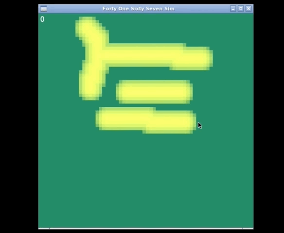

# fluid-simulator
> Real-time fluid simulation in C++

## Overview

This fluid simulation program was part of a computer animation assignment. The implementation is based on both *Stable Fluids* and *Real-time fluid dynamics for games* by Jos Stam. Basically, the simulation uses an Eulerian-approach to the Navier-Stokes equations.

More technically, we use a staggered [Marker-and-cell](http://plaza.ufl.edu/ebrackear/) (MAC) grid over a regular MAC grid to correct for biasing that [central finite differencing](https://en.wikipedia.org/wiki/Finite_difference#Forward,_backward,_and_central_differences) leads to. From there, we compute advection, diffusion and projection components for the particles in each cell, with additional computation made for boundary conditions.


## Usage

**Warning**: Compilation has only been tested on 64-bit Ubuntu systems. It is not guaranteed to compile/link correctly on macOS, Windows or other Linux distros.

```bash
# From source directory... 
$ cd build
$ cmake ..
$ make

# Run in interactive mode
$ build/FOSSSim/FOSSSim -s

# Run a pre-defined simulation
$ build/FOSSSim/FOSSSim -s assets/SystemTests/test01.xml
```

## Controls

| Key              | Action                                                    |
|------------------|-----------------------------------------------------------|
| Right Mouse Drag | Paint particle densities                                  |
| Left Mouse Drag  | Paint velocities                                          |
| D                | Enable debug mode (displays MAC grid and cell velocities) |
| -                | Cycle down the list of particle color maps                |
| +                | Cycle up the list of particle color maps                  |
| R                | Reset the simulation                                      

### Density

Particle densities can be drawn on the MAC grid using the right mouse button.



### Velocity

Velocities can be painted onto the cells of the MAC grid using the left mouse button. These velocities will be used to compute the flow of particles through the grid.


### Color Maps

Pressing -/+ will cycle through the available colormaps.


